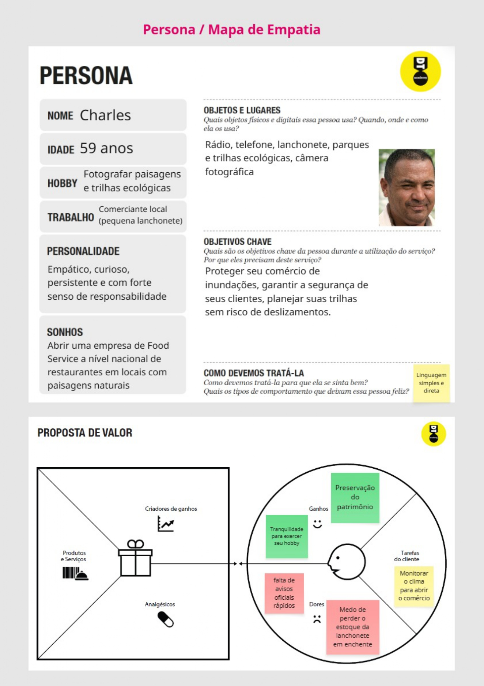
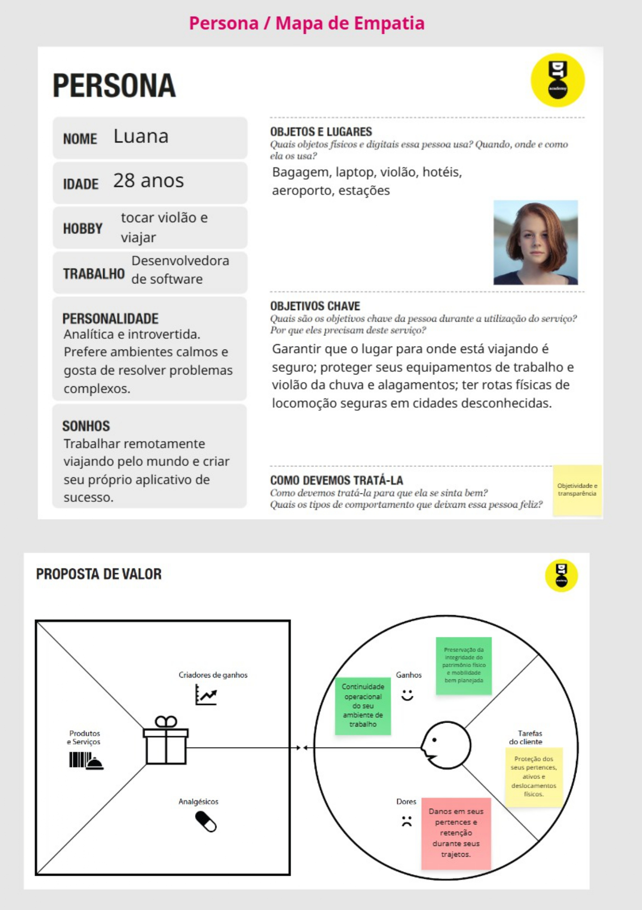
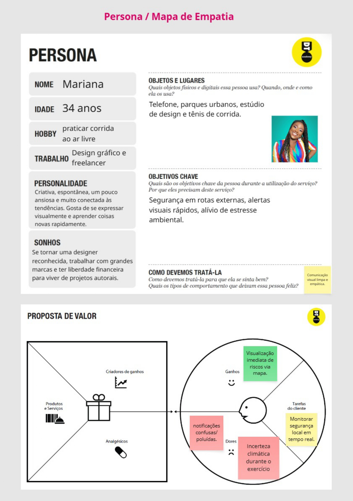
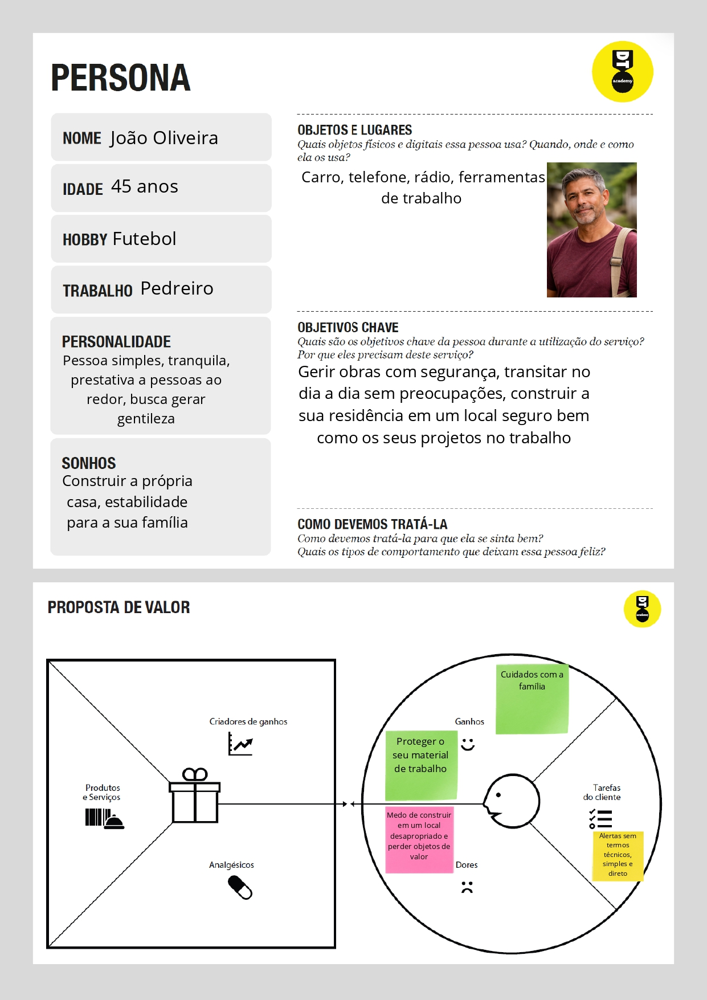
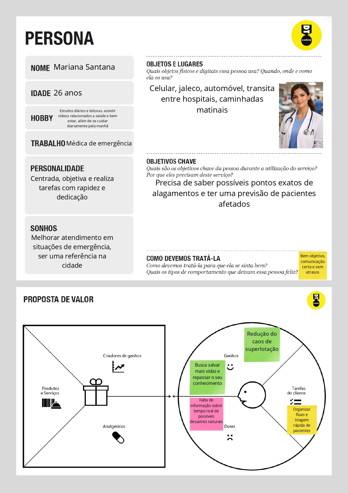
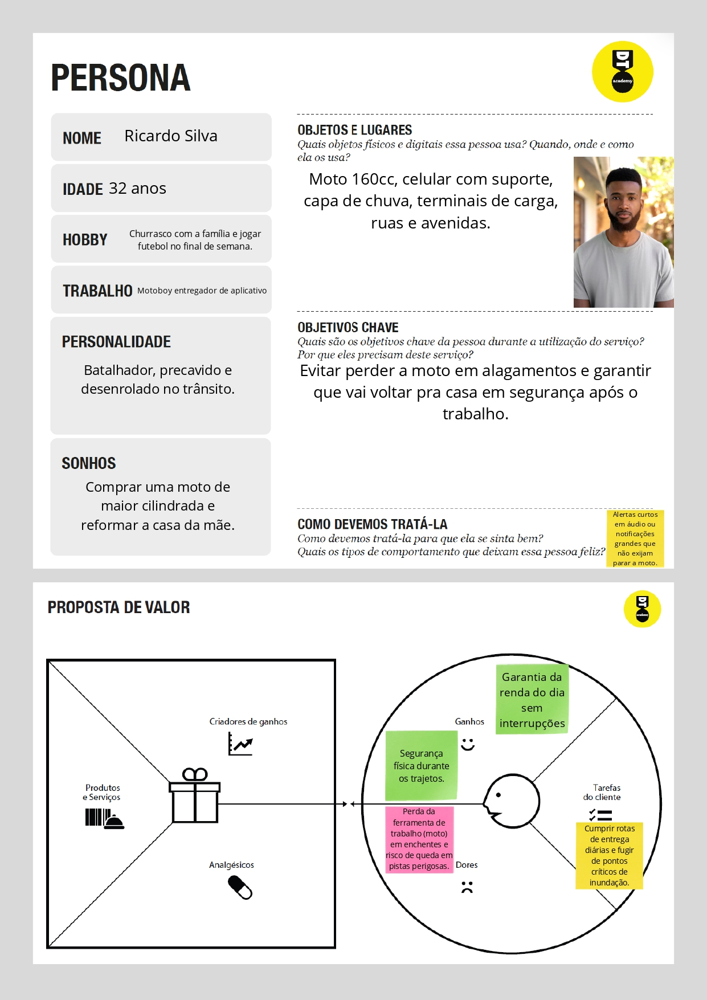

# Product discovery

Pré-requisitos: <a href="01-Contexto.md"> Documentação de contexto</a>

## Etapa de entendimento

* **Matriz CSD: (Certezas, Dúvidas, Suposições)**

Certezas: 
O problema é mais comum em áreas urbanas a nível de corpos d'agua e em relevo acentuado;
O asfalto impermeabiliza o solo, impedindo a filtragem da água;
Um terreno saturado pela água da chuva acarreta em sua erosão.

Dúvidas: 
Quando exatamente vai acontecer;
Qual vai ser a intensidade do desastre;
Quais os locais exatos onde ocorrerá alagamentos e deslizamentos.

Suposições:
O lixo inadequado é um fator que gera tais desastres;
Os deslizamentos de terra podem ocorrer sem chuva;
O aquecimento global favorece chuvas mais intensas.

* **Mapa de stakeholders**:

Pessoas fundamentais:  Moradores ribeirinhos e de encostas, bombeiros, geólogos e engenheiros;

Pessoas importantes: Secretários de Urbanismo, Promotores do Ministério Público, Prefeitos, Ministério das Cidades, Empresas de Saneamento e Limpeza Urbana;

Pessoas influenciadoras: Imprensa e veículos de comunicação, Organismos internacionais como ONU e IPCC, Pesquisadores Universitários, Ativistas de justiça climática.

## Etapa de definição

### Personas

