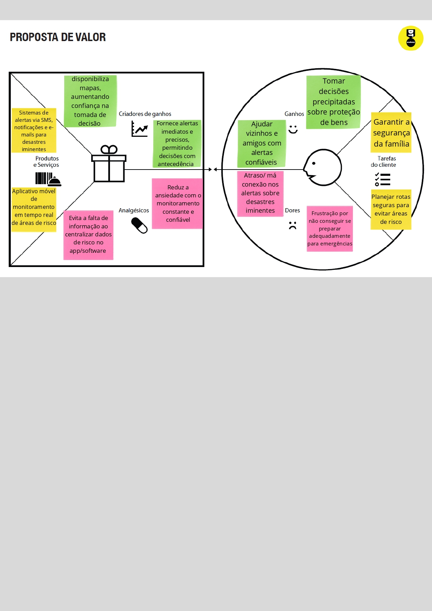
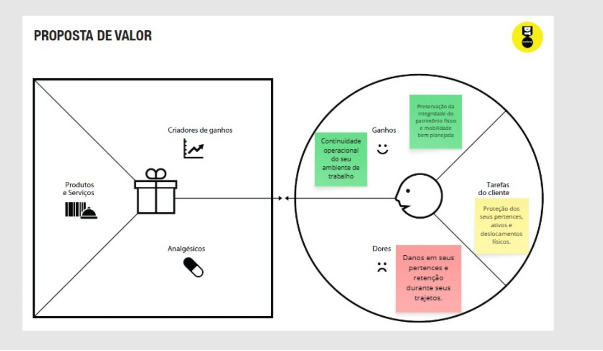
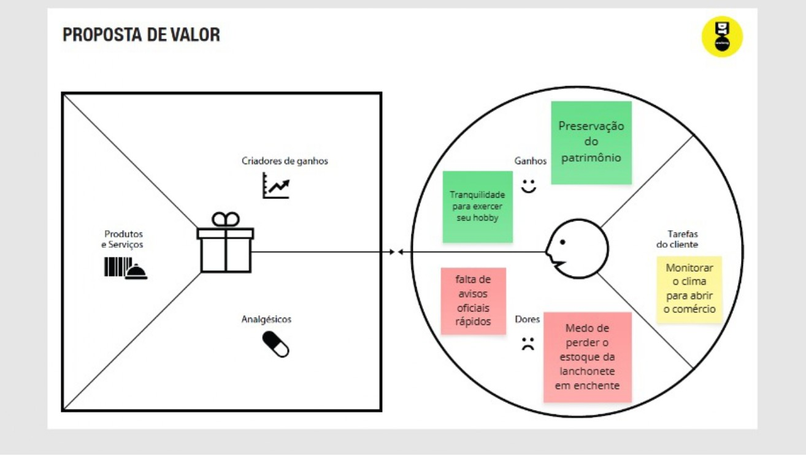
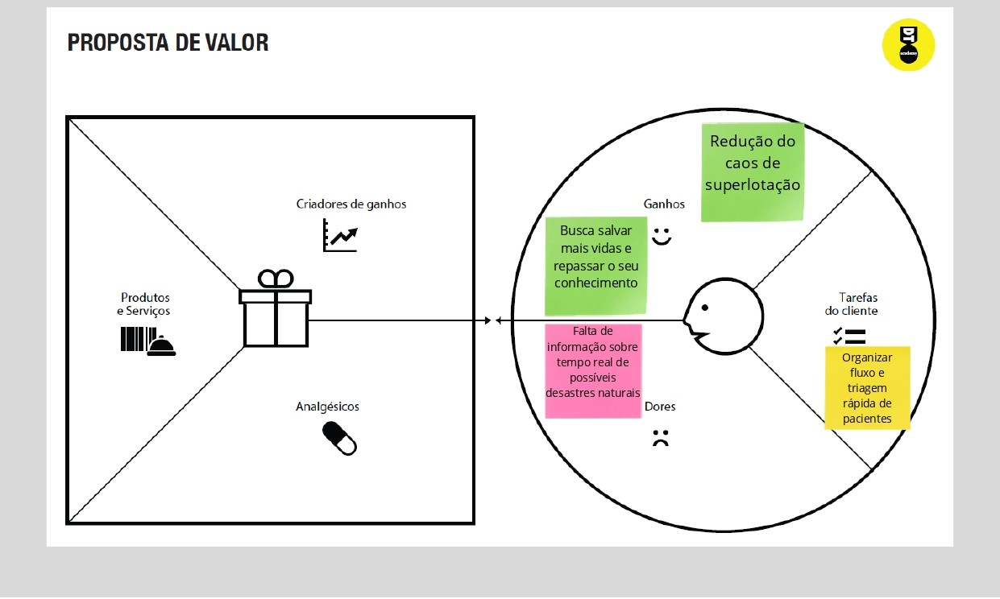
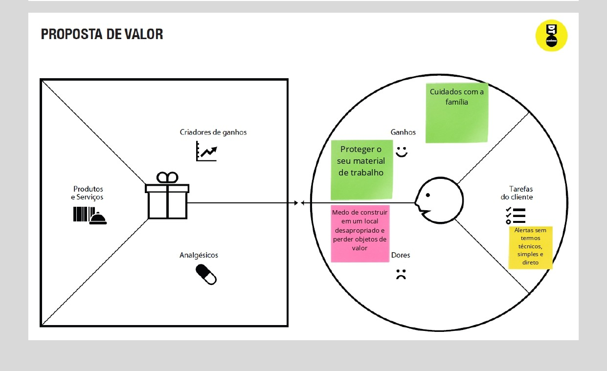
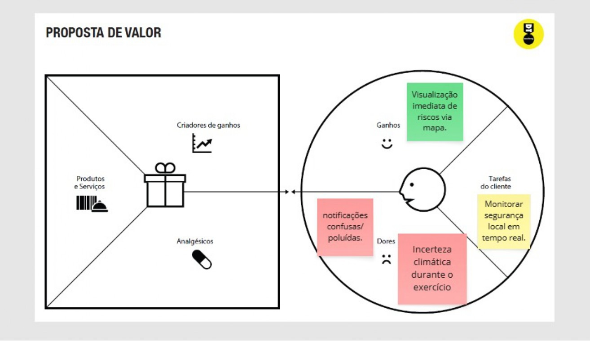
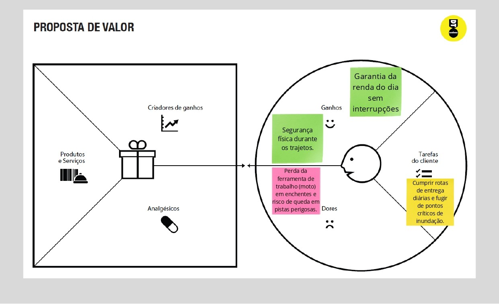

# Product design

## Histórias de usuários

Com base na análise das personas, foram identificadas as seguintes histórias de usuários:

Eu como estudante que vai a pé para a escola, quero identificar áreas com risco de alagamento no meu trajeto para evitar passar por elas.

Eu como morador, quero receber alertas em tempo real sobre desastres naturais próximos para me proteger com antecedência.

Eu como cidadão, quero acessar instruções de segurança para saber como agir durante um desastre natural.

Eu como pesquisador, quero consultar registros de desastres anteriores para analisar padrões.

Eu como usuário, quero identificar o tipo de desastre em cada área para entender o nível e tipo de perigo.

Eu como motorista que se desloca de carro para o trabalho, quero visualizar áreas com risco de alagamento no meu trajeto para escolher rotas mais seguras.

Eu como paramédico que se desloca de ambulância, quero visualizar e evitar áreas com risco de alagamento no trajeto para chegar rapidamente ao local do atendimento.

Eu como entregador, quero visualizar áreas de risco no mapa para planejar rotas e evitar atrasos nas entregas.

Eu como médico que se desloca para o hospital, quero visualizar áreas de risco no trajeto para evitar atrasos em situações críticas.

Eu como engenheiro civil, quero identificar áreas com risco de deslizamento para evitar iniciar obras em locais perigosos.

## Proposta de valor

## Requisitos

As tabelas a seguir apresentam os requisitos funcionais e não funcionais que detalham o escopo do projeto. Para definição das prioridades, foi utilizada uma abordagem simples baseada na importância e impacto para o usuário, classificando os requisitos em alta, média e baixa prioridade.

### Requisitos funcionais

| ID     | Descrição do Requisito                                              | Prioridade |
|--------|---------------------------------------------------------------------|------------|
| RF-001 | Exibir um mapa interativo ao usuário                                | ALTA       |
| RF-002 | Apresentar áreas de risco de alagamento no mapa                     | ALTA       |
| RF-003 | Apresentar áreas de risco de deslizamento                           | ALTA       |
| RF-004 | Utilizar cores para indicar diferentes níveis de risco              | ALTA       |
| RF-005 | Permitir ao usuário visualizar informações ao clicar nas áreas      | MÉDIA      |
| RF-006 | Exibir localização atual do usuário (opcional)                      | BAIXA      |

### Requisitos não funcionais

| ID      | Descrição do Requisito                                              | Prioridade |
|---------|---------------------------------------------------------------------|------------|
| RNF-001 | O sistema deve ser responsivo para dispositivos móveis              | ALTA       |
| RNF-002 | A interface deve ser simples e de fácil utilização                  | ALTA       |
| RNF-003 | O sistema deve carregar o mapa em até 5 segundos                    | MÉDIA      |
| RNF-004 | A aplicação deve ser compatível com os principais navegadores       | MÉDIA      |
| RNF-005 | O sistema deve apresentar informações de forma clara e organizada   | ALTA       |

