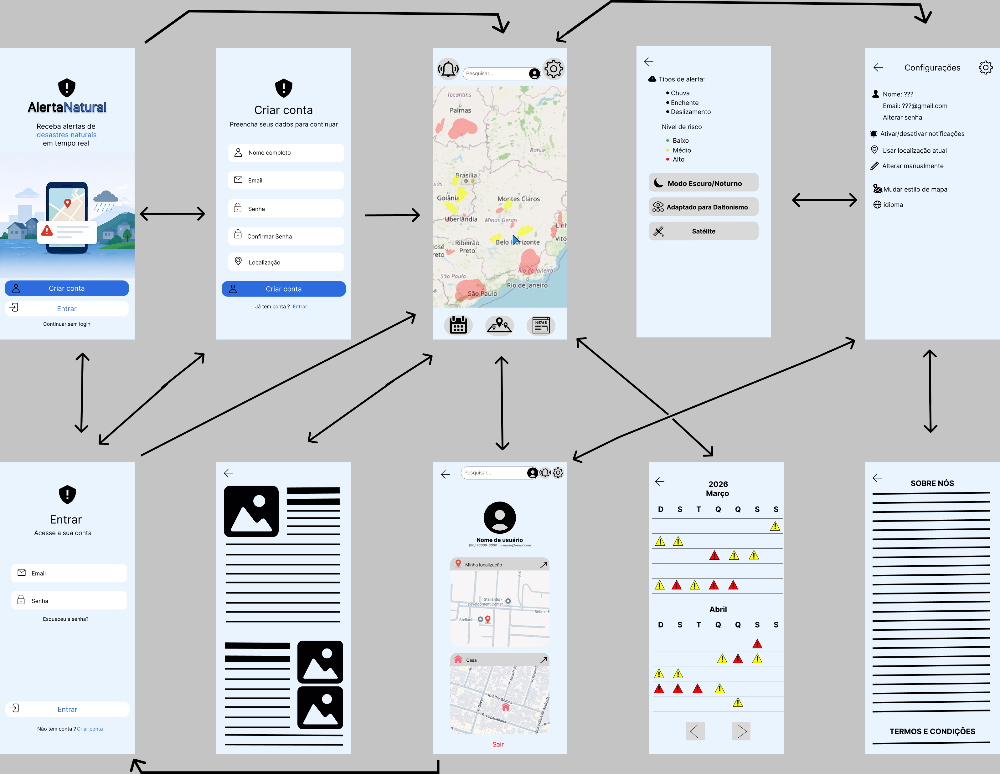
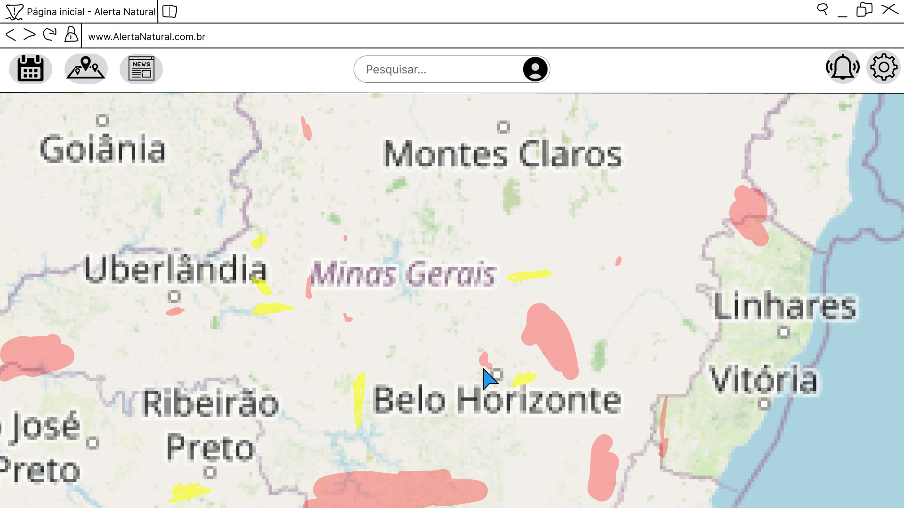

# Projeto de interface

Pré-requisitos: <a href="03-Product-design.md"> product design</a>

 Visão geral da interação do usuário pelas telas do sistema e protótipo interativo das telas com as funcionalidades que fazem parte do sistema (wireframes).

 ## User flow

## Wireframes

Tela inicial responsiva para desktop, com  mapa e opções ao usuário.

 

### Protótipo Interativo

✅ [Protótipo interativo](https://www.figma.com/proto/5ngUdAZrCUx8uVq4V3tU8B/Sem-t%C3%ADtulo?node-id=36-5&p=f&t=JtzgQFsxIomzpWGx-0&scaling=scale-down&content-scaling=fixed&page-id=0%3A1)
